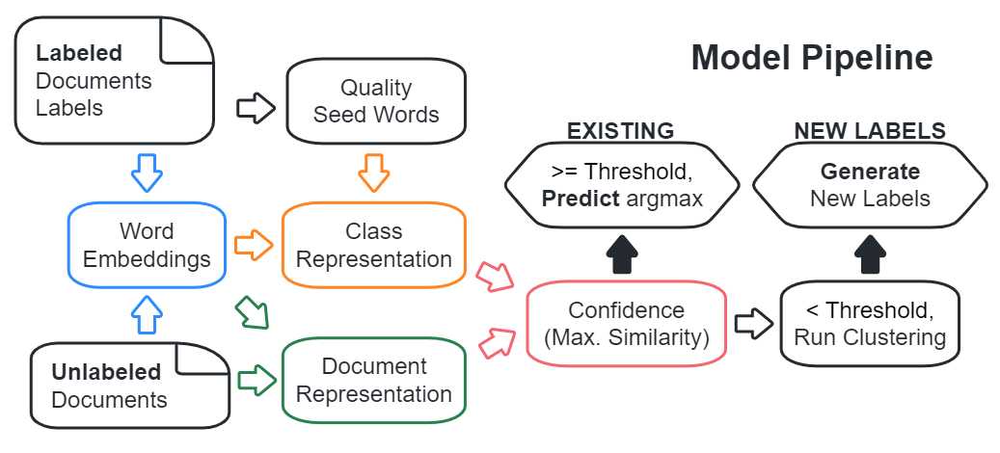

# Incomplete Supervision: Text Classification based on a Subset of Labels

In this project, we explore the **I**n**c**omplete **T**ext **C**lassification (IC-TC) setting. We aim to design a text classification model that could suggest class names not belonging to the training corpus to unseen documents, and classify documents into a full set of class names.

<div style="display:flex;">
    <div style="width:100%;">
        Authors: Luning Yang, Yacun Wang<br>Mentor: Jingbo Shang
    </div>
    <div style="float:right">
        
    </div>
</div>


### Model Pipeline
- Find seed words from the supervised set: TF-IDF
- Use full corpus to find word embeddings
  - Final Model: Pretrained `BERT` contextualized word embeddings using static representations guided by `XClass`, reduced dimensions using PCA
  - Baseline Model: Trained `Word2Vec` word embeddings
- Find document and class embeddings based on averaged word embeddings, from the documents or seed words
- Compute similarity as confidence score, predict argmax if confidence over threshold
- For other unconfident documents, run clustering and label generation (LI-TF-IDF or Prompted ChatGPT)
<p align="center"></p>


### Environment

- [**DSMLP Users**]: Since the data for this project is large, please run DSMLP launch script using a larger RAM. The suggested command is `launch.sh -i yaw006/incomplete-tc:final -m 16 -g 1`. Please **DO NOT** use the default, otherwise Python processes will be killed halfway.
- Other options:
  - Option 1: Run the docker container: `docker run yaw006/incomplete-tc:final`;
  - Option 2: Install all required packages in `requirements.txt`.

### Data
#### Data Information
- The datasets used in the experiments can be found on [Google Drive](https://drive.google.com/drive/folders/1kf3AXpKbwbZuQhcVSiaMzCiaSrWTdO7i?usp=sharing).
- The datasets used in the experiments are: `DBPedia`, `DBPedia-small`, `nyt-fine`, `Reddit`
- **Note**: `DBPedia-small` is the default experiment target dataset, as it contains a subset of documents for the full `DBPedia` dataset, and could be run in a few minutes.

#### Get Data
- [**DSMLP Users**]: For the 3 datasets provided, convenient Linux commands to download and get the data are provided in the [documentation of raw data](data/raw/). Please run the commands in the **repository root directory**.
- Generally, under Linux command line, for any Google Drive zip file, 
  - Follow the `wget` [tutorial](https://medium.com/@acpanjan/download-google-drive-files-using-wget-3c2c025a8b99)
    - Find the Large File section (highlighted code section towards the end)
    - Paste the `<FILEID>` from the `zip` file **sharing link** found on Google Drive
    - Change the `<FILENAME>` to your data title
  - Run `cd <dir>` to change directory into the data directory
  - Run `unzip -o <zip name>` to unzip the data
  - Run `rm <zip name>` to avoid storing too many objects in the container
  - Run `cd <root>` to change directory back to your working directory
  - Run `mkdir <data>` to create the processed data directory
- Under non-command line, go to the Google Drive link, download the zip directly, place the files according to the requirements in the **Data Format** section, and manually created the directory needed for processed files. See the **File Outline** section for example.

#### Data Format
- Raw Data: Each dataset must contain a `df.pkl` placed in `data/raw/`. The file should be a compressed Pandas DataFrame using `pickle` containing two columns: `sentence` (for documents) and `label` (for the corresponding label).
- Processed Data: 
  - The corpus will be processed after the first run, and processed files will be placed in `data/processed`.
  - The processed file will be directly loaded for subsequent runs.

### Commands
[**DSMLP Users**]: 
- The `test` target could be easily run as `python run.py test`.
- The `experiment` target could be run as `python run.py exp -d <dataset>`.
- When prompted from the prompt, insert values.

The main script is located in the root directory. It supports 3 targets:
- `test`: Run the test data. All other flags are ignored.
- `experiment` (or `exp`) [default]: Perform one vanilla run.

The full command is:
```
python run.py [-h] target [-d DATA] [-m MODEL]

required: target {test,experiment,exp}
  run target. Default experiment; if test is selected, run final model on testdata.

optional arguments:
  -h, --help                 show this help message and exit
  -d DATA, --data DATA       data path, required for non-testdata
  -m MODEL, --model MODEL    model pipeline, {'final', 'baseline'}. Default 'final'
```
**Note**: Due to time constraints and container constraints, the short experiments are chosen to run fast, which means performance is not guaranteed.


### Code File Outline
```
Incomplete-Text-Classification/
├── run.py                           <- main run script
├── data/                            <- all data files
│   ├── raw                          <- raw files (after download)
│   │   ├── nyt-fine
│   │   |   └── df.pkl               <- required DataFrame pickle file
│   |   └── ...
│   └── processed/                   <- processed files (after preprocessing)
├── src/                             <- source code library
│   ├── data.py                      <- data class definition
│   ├── word_embedding.py            <- word embedding modules
│   ├── similarity.py                <- computing similarities and cutoff
│   ├── unsupervised.py              <- dimensionality reduction and clustering
│   ├── generation.py                <- label or seed word generation
│   ├── evaluation.py                <- evaluation methods
│   ├── models.py                    <- model pipelines
│   └── util.py                      <- other utility functions
└── test/                            <- test target data
```

---
### Citations

#### Word2Vec
```
@article{word2vec,
    title={Efficient estimation of word representations in vector space},
    author={Mikolov, Tomas and Chen, Kai and Corrado, Greg and Dean, Jeffrey},
    journal={arXiv preprint arXiv:1301.3781},
    year={2013}
}
```

#### XClass
```
@misc{wang2020xclass,
      title={X-Class: Text Classification with Extremely Weak Supervision}, 
      author={Zihan Wang and Dheeraj Mekala and Jingbo Shang},
      year={2020},
      eprint={2010.12794},
      archivePrefix={arXiv},
      primaryClass={cs.CL}
}
```

#### BERT
```
@article{devlin2018bert,
  title={BERT: Pre-training of Deep Bidirectional Transformers for Language Understanding},
  author={Devlin, Jacob and Chang, Ming-Wei and Lee, Kenton and Toutanova, Kristina},
  journal={arXiv preprint arXiv:1810.04805},
  year={2018}
}
```
